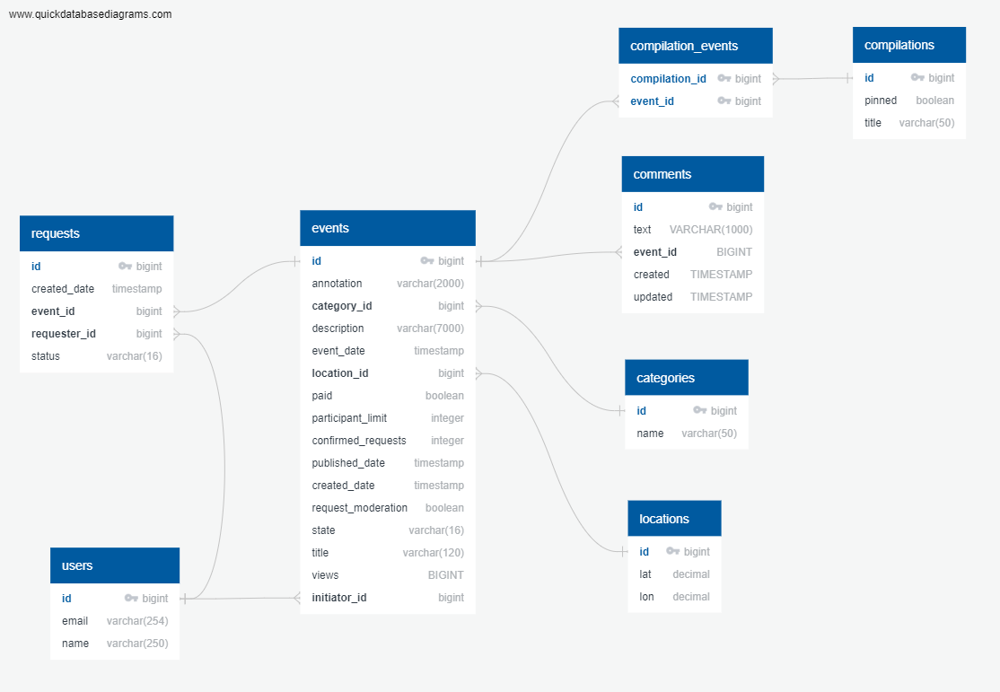

# Проект «Исследуй со мной»

### [Ссылка на Репозиторий](https://github.com/mvinogradovHub/java-explore-with-me/pull/4)

## Идея
Свободное время — ценный ресурс. Ежедневно мы планируем, как его потратить — куда и с кем сходить. Сложнее всего в таком планировании поиск информации и переговоры. Нужно учесть много деталей: какие намечаются мероприятия, свободны ли в этот момент друзья, как всех пригласить и где собраться.
Созданное приложение — афиша. В этой афише можно предложить какое-либо событие от выставки до похода в кино и собрать компанию для участия в нём.

## Состав

* **ewm-service** - основной сервис содердит всё необходимое для работы продукта;
* **ewm-statistics** - сервис статистики хранит количество просмотров и позволит делать различные выборки для анализа работы приложения.

## Схема БД ewm-service

## Фича для самостоятельного проектирования

### Постановка задачи
Улучшение модерации событий администратором — возможность выгружать все события, ожидающие модерации, делать их проверку, а также оставлять комментарий для инициатора события, если оно не прошло модерацию. При этом у инициатора есть возможность исправить замечания и отправить событие на повторную модерацию.

### Формулирование требований

Исходя из постаноки задачи я выделил следующие требования к разрабатываемой функциональности:
1. администратор может выгружать все события, ожидающие модерации
2. администратор может менять статус события если не прошло модерацию
3. администратор может оставлять комментарий для инициатора события, если оно не прошло модерацию
4. инициатор может исправить замечания, если оно не прошло модерацию
5. инициатор может отправить событие на повторную модерацию.

### Ограничения 
Нельзя создавать новую статусную модель событий т.к. в этом случае не пройдут POSTMAN тесты второго этапа разработки. Причем разработчик не может повлиять на работу этих тестов

### Решение

1. Ожидающие модерацию события имеют статус PENDING. В этот статус событие переходит сразу после создания пользователем. Т.к. у администратора есть метод поиска событий GET /admin/events?states={} с возможностью фильтрации по states, то администратор уже может получить все события, ожидающие модерации. Разработка не требуется.
2. Для управления модерацией для администраотра разработан новый эндпойнт PATCH /admin/events/{}/moderation. При поступлении события в статусе PENDING, администратор может взять его в работу, присвоив статус MODERATION. Пока администратор работает с событием, оно не доступно для рекдтирования и изменения пользователем. Если событие не прошло модерацию, администратор может его отклонить (статус CANCELED). 
3. При изменении статуса события администратором с помощью метода PATCH /admin/events/{}/moderation на статус CANCELED, он должен иметь возможность добавить комментарий. Для этого во входной DTO EventModerationByAdminDto нового метода я добавил поле комментария commentOnRejection. Комментарий можно оставить при любом измении статуса. Также  у админа приствует возможность отредактировать и удалить оставленный комментарий. Для этого предусмотрен отдельный эндпойнт /admin/events/{}/comments/{}.
4. Эта функциональность и так есть у пользователя с помощью метода PATCH /users/{userId}/events/{eventId}. Изменив необходимые поля, он может исправить замечания.
5. Эта функциональность и так есть у пользователя с помощью метода PATCH /users/{userId}/events/{eventId}. Указав во входящем объекте stateAction = SEND_TO_REVIEW, он иожет отправить на повторное ревью
6. Добавлены ограничения для публичных эндпойнтов. Теперь они возвращают только опубликованные события без возможности просмотра комментариев администратора. 
7. С помощью нового эедпойнта PATCH /admin/events/{}/moderation администратор также может опубликовать событие прощедшее модерацию. 

### Проверка

Реализована проверка Postman, которая проверяет выполнение указанных требований
